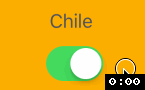

# 🍞 BreadcrumbButton

Custom control for represent "breadcrumbs" in some app.

Has 3 states:

| Normal | Highlighted | Disabled |
|:------:|:--------:|:-----------:| 
|  |   |  |

## Attention!

> Unfortunately changing the state can't be animated!